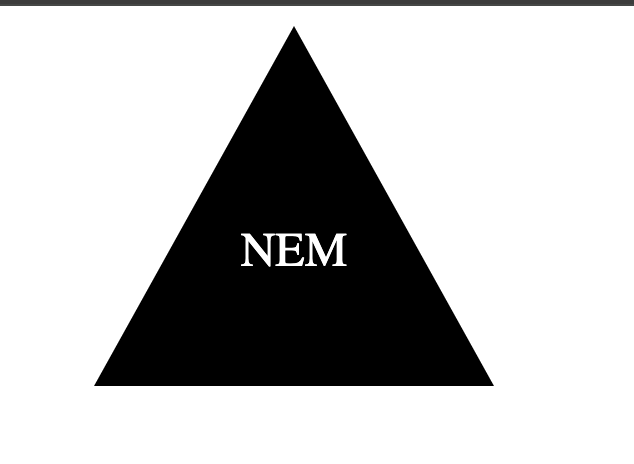

# svglogomaker

## Description
  We were tasked in our Bootcamp to create a logo generator using Node.JS
  

## Installations
use the node index.js command in the terminal

## Usage
To use the skills we've learned in class to build a logo generator. Here is a video walkthrough - https://app.screencastify.com/v3/watch/39F3UokU3l7MzzypgaKF

## Credits
W3Schools, freecodecamp.org

## License
None

## Questions:
Feel free to reach out on Github for further questions: nmahban
